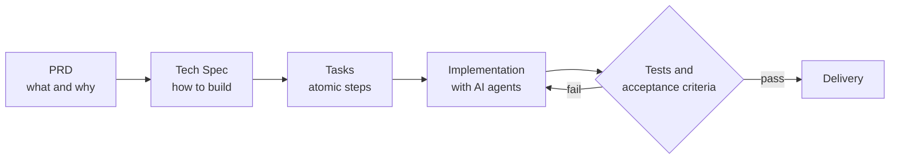

## 👋 About me

Full stack engineer who **ships to production and speeds up with AI without giving up quality**. I work on a real-time logistics platform, taking each feature from specification to deploy: I model the data, build the API and the interface, **measure before optimizing**, and only ship what passes tests and acceptance criteria.

My background joins code, architecture and data: Systems Analysis and Development, a postgraduate degree in Java and an MBA in Business Intelligence.

## 📈 Results in numbers

| 220+ | 25.3 s → 1.4 s | 6 | 11 |
| :---: | :---: | :---: | :---: |
| commits in the first month | orders listing, after measuring the baseline (staging) | complete projects in 14 months | repositories shipped to production |

## 🤖 How I work with AI

I use **Spec-Driven Development (SDD)**: AI works inside traceable steps, and nothing lands without validation.

- **Own rules and skills:** code, testing and environment-variable standards applied to every delivery.
- **Verification:** AI output is never taken on faith; it goes through tests and acceptance criteria.
- **Tools:** Claude Code, AI agents, context engineering, N8N and Gemini AI.

## 🛠️ Stack

   
  

| Area | Technologies |
| --- | --- |
| Front end | Angular, React, Next.js, React Native, Expo, Tailwind CSS, SCSS, shadcn/ui |
| Back end | NestJS, Node.js, TypeORM, Drizzle, PostgreSQL, Supabase, Redis, WebSocket, REST, Zod |
| Quality and delivery | Jest, Playwright, GitHub Actions, Docker, Postman, Azure DevOps, Grafana |
| AI and automation | Claude Code, AI agents, rules and skills, N8N, WhatsApp API, Gemini AI |
| Design | Figma (Auto Layout, prototypes), Framer, UX Writing |

## 💼 Experience

**Help Entregas** | Full Stack Developer (contract) | 09/2026 to present
Delivery logistics platform with a NestJS API, Angular front end, mobile app and real-time allocator.
- **Performance:** orders listing from 8.7–25.3 s to 0.9–1.4 s with a composite index (660k rows, staging).
- **Scale:** distributed allocator with state in Redis, sockets across pods and load tests.
- **Resilient integrations:** freight quote by postal code with provider fallback, circuit breaker and cache, within 3 s.
- **Product:** delivery confirmation code by SMS and management dashboards (on-time delivery, Pix, courier ranking).

**Brakeel** | Full Stack Developer (contract) | 12/2024 to 01/2026
6 complete projects in 14 months, from concept to deploy: clinic SaaS, CRM, election survey with dashboard, Q&A rooms and a barbershop booking app, using Angular, React, Next.js, PostgreSQL and Supabase.

## 🚀 Featured projects

| Project | What it is | Stack |
| --- | --- | --- |
| [doutor-agenda](https://github.com/Hamilton-Rodrigues-dev/doutor-agenda) | Clinic SaaS: scheduling, patients, doctors, dashboard and subscription | Next.js, Drizzle, Stripe |
| [doto](https://github.com/Hamilton-Rodrigues-dev/doto) | CRM with Kanban, tasks, calendar and AI agents | React, TypeScript, Supabase |
| [Playwright](https://github.com/Hamilton-Rodrigues-dev/Playwright) | E2E tests for critical flows with CI | Playwright, GitHub Actions |
| [barbershop](https://github.com/Hamilton-Rodrigues-dev/barbershop) | Barbershop booking app | Next.js, Drizzle |

## 🎓 Education

- 🎓 **MBA in Business Intelligence**, UNIASSELVI (2025)
- 🎓 **Postgraduate degree in Java Systems Development**, UNIASSELVI (2025)
- 🎓 **Technologist degree in Systems Analysis and Development**, Estácio (2024)

---

### 📫 Let's talk

