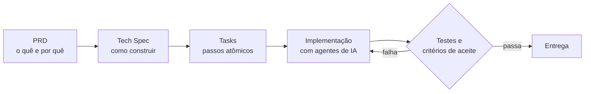

## 👋 Quem sou

Engenheiro full stack que **entrega em produção e acelera com IA sem abrir mão de qualidade**. Trabalho em uma plataforma de logística em tempo real, onde levo a feature da especificação ao deploy: modelo os dados, construo API e interface, **meço antes de otimizar** e só entrego o que passa em testes e critérios de aceite.

Minha formação une código, arquitetura e dados: Análise e Desenvolvimento de Sistemas, pós-graduação em Java e MBA em Business Intelligence.

## 📈 Resultados em números

| 220+ | 25,3 s → 1,4 s | 6 | 11 |
| :---: | :---: | :---: | :---: |
| commits no primeiro mês | listagem de pedidos, após medir a linha de base (homologação) | projetos completos em 14 meses | repositórios entregues em produção |

## 🤖 Como trabalho com IA

Uso **Spec-Driven Development (SDD)**: a IA trabalha dentro de etapas rastreáveis, e nada entra sem validação.

- **Rules e skills próprias:** padrões de código, testes e variáveis de ambiente aplicados a cada entrega.
- **Verificação:** a saída da IA nunca é aceita no escuro; ela passa por testes e critérios de aceite.
- **Ferramentas:** Claude Code, agentes de IA, engenharia de contexto, N8N e Gemini AI.

## 🛠️ Stack

   
  

| Área | Tecnologias |
| --- | --- |
| Front end | Angular, React, Next.js, React Native, Expo, Tailwind CSS, SCSS, shadcn/ui |
| Back end | NestJS, Node.js, TypeORM, Drizzle, PostgreSQL, Supabase, Redis, WebSocket, REST, Zod |
| Qualidade e entrega | Jest, Playwright, GitHub Actions, Docker, Postman, Azure DevOps, Grafana |
| IA e automação | Claude Code, agentes de IA, rules e skills, N8N, WhatsApp API, Gemini AI |
| Design | Figma (Auto Layout, protótipos), Framer, UX Writing |

## 💼 Experiência

**Help Entregas** | Desenvolvedor Full Stack (PJ) | 09/2026 a atual
Plataforma de logística de entregas com API NestJS, front Angular, app móvel e alocador em tempo real.
- **Performance:** listagem de pedidos de 8,7–25,3 s para 0,9–1,4 s com índice composto (660 mil linhas, homologação).
- **Escala:** alocador distribuído com estado no Redis, sockets em vários pods e testes de carga.
- **Integrações resilientes:** cotação de frete por CEP com fallback entre provedores, circuit breaker e cache, em até 3 s.
- **Produto:** código de finalização por SMS e painéis de gestão (OTD, Pix, ranking de entregadores).

**Brakeel** | Desenvolvedor Full Stack (PJ) | 12/2024 a 01/2026
6 projetos completos em 14 meses, da concepção ao deploy: SaaS de clínica, CRM, pesquisa eleitoral com dashboard, salas de perguntas e agendamento de barbearia, com Angular, React, Next.js, PostgreSQL e Supabase.

## 🚀 Projetos em destaque

| Projeto | O que é | Stack |
| --- | --- | --- |
| [doutor-agenda](https://github.com/Hamilton-Rodrigues-dev/doutor-agenda) | SaaS de clínica: agenda, pacientes, médicos, dashboard e assinatura | Next.js, Drizzle, Stripe |
| [doto](https://github.com/Hamilton-Rodrigues-dev/doto) | CRM com Kanban, tarefas, agenda e agentes de IA | React, TypeScript, Supabase |
| [Playwright](https://github.com/Hamilton-Rodrigues-dev/Playwright) | Testes E2E de fluxos críticos com CI | Playwright, GitHub Actions |
| [barbershop](https://github.com/Hamilton-Rodrigues-dev/barbershop) | Agendamento de barbearia | Next.js, Drizzle |

## 🎓 Formação

- 🎓 **MBA em Business Intelligence**, UNIASSELVI (2025)
- 🎓 **Pós-graduação em Desenvolvimento de Sistemas em Java**, UNIASSELVI (2025)
- 🎓 **Tecnólogo em Análise e Desenvolvimento de Sistemas**, Estácio (2024)

---

### 📫 Vamos conversar?

